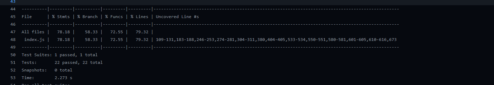
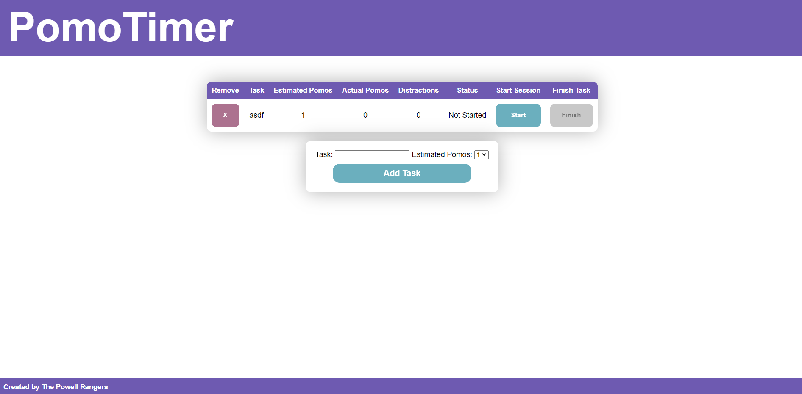
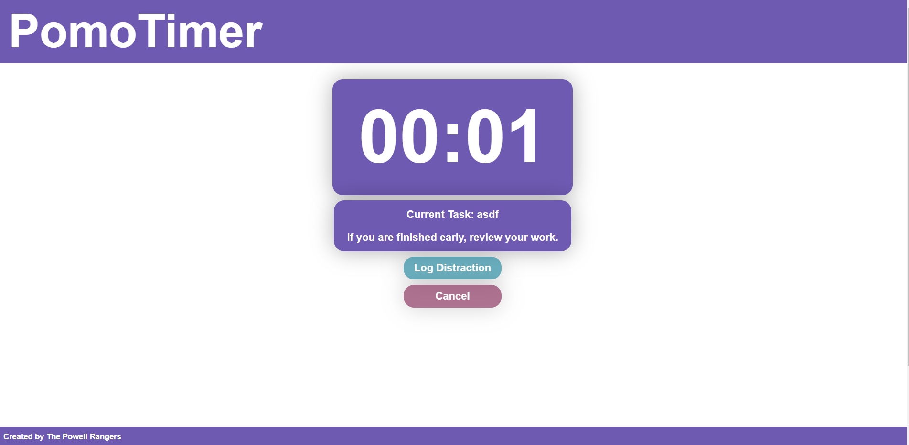
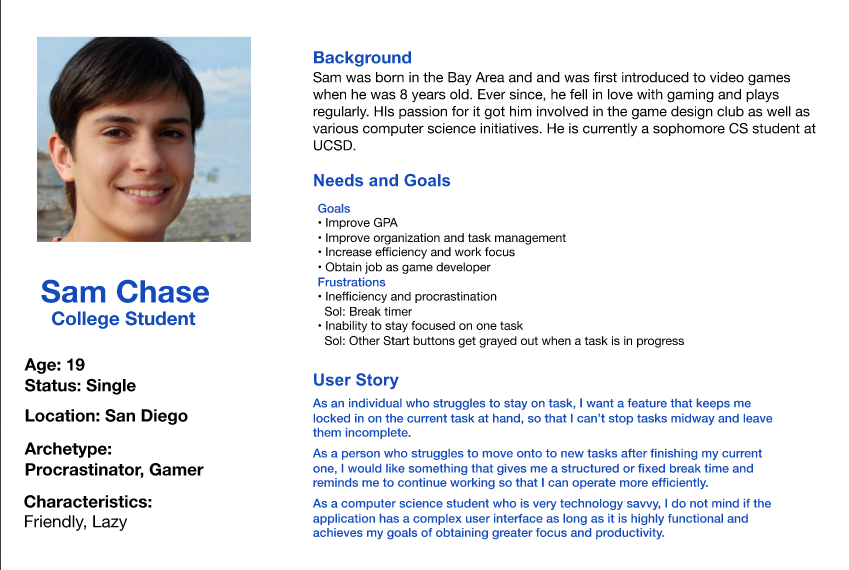

# Team 9 - 03/08/21

- Goal: Sprint Review
- Members Present: Everyone
- Members Absent:
- Meeting Logistics
  - Start: 6:30 PM
  - End: 8:00 PM
- Week 1 Goals
  - [x] Commit Style Guide
  - [x] Design Fixes
  - [x] Added ADRs
  - [x] User Story Fixes
  - [x] Proposed Accessibility
  - [x] Finalized Styling
  - [x] Completed CSS
  - [x] Created More Test Goals
- Week 2 Goals

  - [x] Code Clean Up
  - [x] Added Documentation
  - [x] Bug Fixes
  - [x] Added Accessibility
  - [x] Added more ADRs
  - [x] Added Local Storage
  - [x] Test Coverage Goal 70%+

- Highlights

  - GitHub Setup
    - Mandatory meeting feedback
    - Meeting Notes
    - CI/CD Pipeline
    - Issues/Pull Requests
    - JS API Proposal
    - Code Files (JavaScript, HTML, CSS)
    - Testing Library (Jest)
  - Working Prototype
    - Task Manager
    - Timer
  - How we Worked

    - Mob Programming
      - Discord audio channels with screen sharing
      - Gary worked as driver who shared his screen
      - VSCode Live Sharing

  - Test Suite on CI/CD Pipeline
    
  - Final Task Page
    
  - Final Timer Page
    
  - Revised User Story
    
